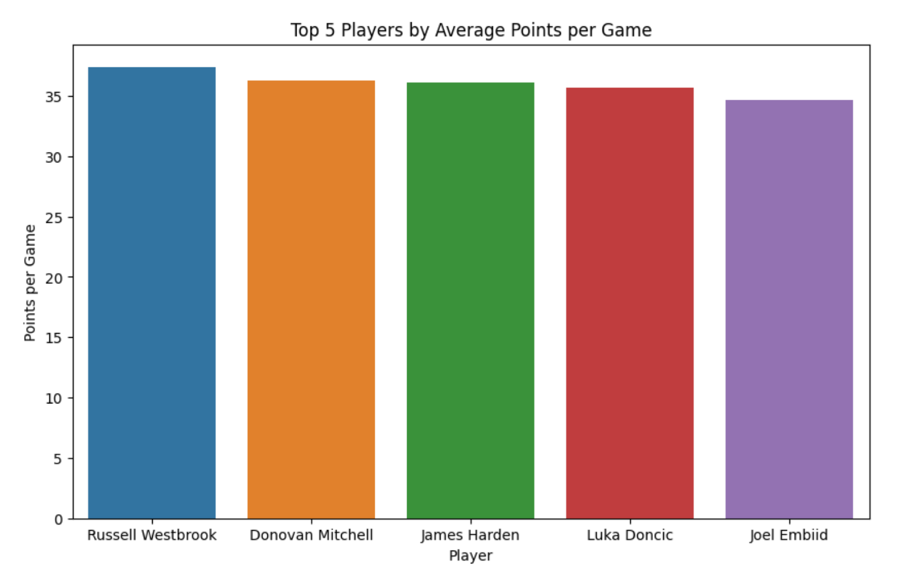
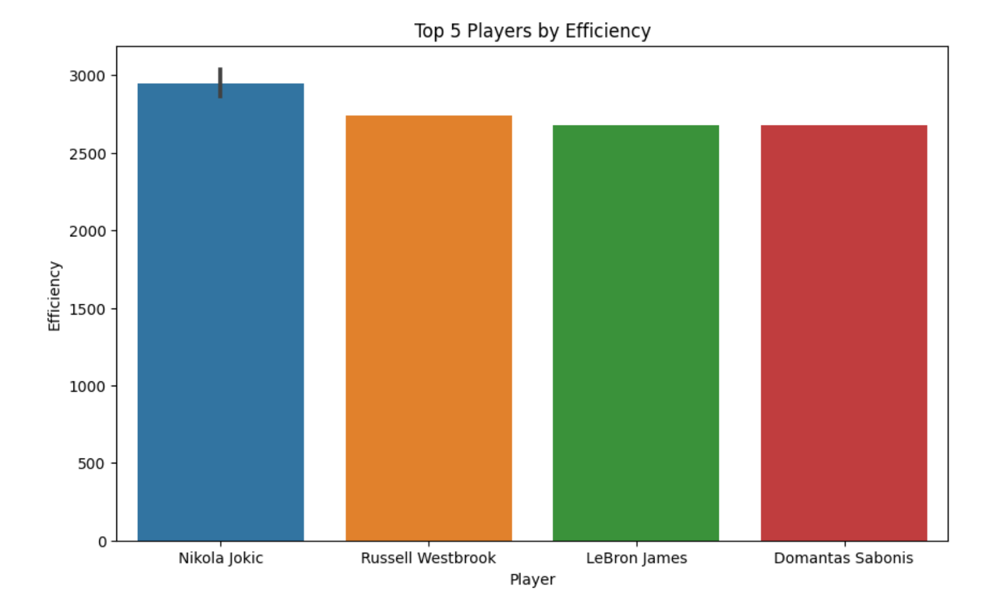

View the notebook at Kaggle: https://www.kaggle.com/code/dricmoy/top-performers-in-the-nba-analysis

Used a free NBA stats dataset, in the format: 
      year       Season_type  PLAYER_ID  RANK           PLAYER     TEAM_ID  \
0  2012-13  Regular%20Season     201142     1     Kevin Durant  1610612760   
1  2012-13  Regular%20Season        977     2      Kobe Bryant  1610612747   
2  2012-13  Regular%20Season       2544     3     LeBron James  1610612748   
3  2012-13  Regular%20Season     201935     4     James Harden  1610612745   
4  2012-13  Regular%20Season       2546     5  Carmelo Anthony  1610612752   

  TEAM  GP   MIN  FGM  ...  REB  AST  STL  BLK  TOV   PF   PTS   EFF  AST_TOV  \
0  OKC  81  3119  731  ...  640  374  116  105  280  143  2280  2462     1.34   
1  LAL  78  3013  738  ...  433  469  106   25  287  173  2133  1921     1.63   
2  MIA  76  2877  765  ...  610  551  129   67  226  110  2036  2446     2.44   
3  HOU  78  2985  585  ...  379  455  142   38  295  178  2023  1872     1.54   
4  NYK  67  2482  669  ...  460  171   52   32  175  205  1920  1553     0.98   

   STL_TOV  
0     0.41  
1     0.37  
2     0.57  
3     0.48  
4     0.30  

